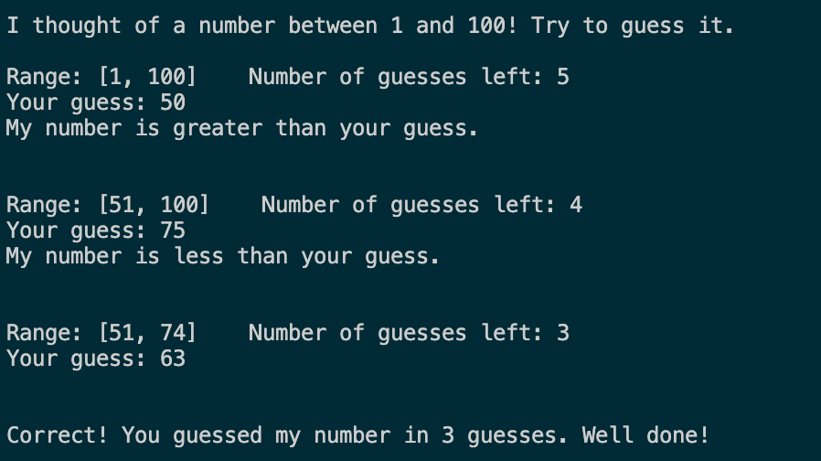
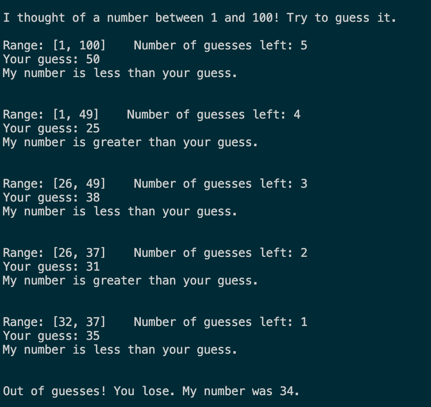

## Integer Guessing Game

In this assignment, you will create an integer guessing game played by the user against the computer.

### Description

Implement an integer guessing game. The program should randomly choose an integer between 1 and 100 (inclusive), and have the user try to guess that number.

The implementation requirements are as follows:

- The user can guess at most 5 times
- Before each guess, the program should announce:
  - An updated guessing range, with a minimum and maximum possible value
  - The number of remaining guesses
- If the user guesses correctly, the program should congratulate them and tell them how many guesses they used
- If the user guesses wrong and there are guesses remaining, the program should inform the user if the computer's number is bigger or smaller than the user's guess
- If the user guesses wrong and there aren't any remaining guesses, the program should reveal the number it chose

Feel free to give the computer some "personality" elements, such as words of encouragement or snarky responses for wrong guesses.

See the examples below for the general format of your output.

Example 1:

Example 2:

### Learning Targets

By the end of this assignment, you should be able to:
