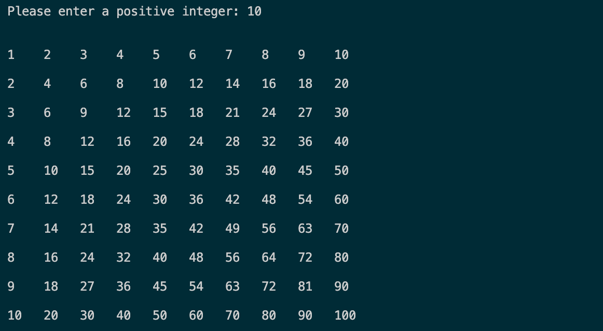

## Times Table

In this assignment, students create an aligned times table using a loop structure of their choice.

### Description

Using an integer _n_ from the user, print to console the _n_ by _n_ times table. Each column of the table must be properly aligned, meaning that your program must account for the differing number of digits in the various numbers of the table. See the example below for the desired output.

### Learning Targets

By the end of this assignment, students will:

- Evaluate and choose a loop structure based on whether it is well suited to the assigned task.
- Reuse a single block of code multiple times to solve a problem or complete a task.
- Create customized `print()` statements using the keyword argument `end`.
- Properly align text in the console by dynamically allocating and printing the correct number of spaces.
