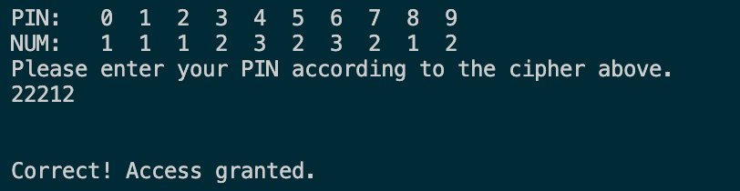
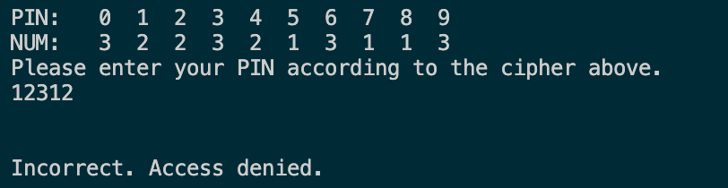

## PIN Authentication

In this assignment, you will write a PIN authentication program that helps avoid PIN and password theft.

### Description

Traditional password entry schemes are susceptible to 'shoulder surfing,' in which an attacker watches an unsuspecting user enter their passowrd of PIN number, and uses it later to gain access to the account. One way to combat this susceptibility is to implment a randomized challenge-response system. In these systems, the user enters different information every time, based on a secret that corresponds to a randomly generated challenge.

Consider the following scheme: A password consists of a five-digit PIN Number (00000 to 99999). Each digit is randomly assigned a 1, 2, or 3. The user enters the numbers that correspond to their PIN instead of their actual PIN.

For example, let the user's PIN be 12345. To authenticate, the user wuold be presneted with a screen such as:

PIN: 0 1 2 3 4 5 6 7 8 9  
NUM: 3 2 3 1 1 3 2 2 1 3

The user would enter 23113 instead of 12345. This doesn't divulge the password even if an attacker intercepts the entry because 23113 could correspond to other PIN numbers, such as 69440 or 70439.

The next time the user logs in, a different sequence of random numbers would be generated, like:

PIN: 0 1 2 3 4 5 6 7 8 9  
NUM: 1 1 1 2 3 1 2 3 3 2

Write a program to simulate this authentication process. Store an actual 5-digit PIN as a constant in your program. Use a list to assign random numbers to the digits 0 through 9. Output the random digits to the screen, input the response from the user, and output whether the authentication is successful.

Think about how to break down your implementation into functions. You should have _at least three_ non-main functions, each of which should have a clear purpose.

Include a main function that allows a user to interact with your program. The output should look like the sample below (the PIN in the sample is 75309).

### Learning Targets

By the end of this assignment, you should be able to:

- Convert lists to strings and strings to lists, maintaining the integrity of data contained in both data types
- Encrypt PIN numbers using a randomized cipher
- Apply string and list methods to complete tasks
- Write multiple functions, each of which accomplish exactly one thing
