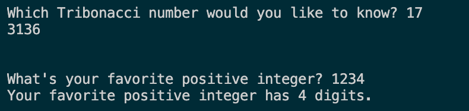

## Recursion Practice 1

In this assignment, you will write two different programs to practice recursion.

### Description

For each of the parts below, implement the function described. Then write a main function that demonstrates the functionality of each part. Be sure to test many cases before turning in your assignment. The edge cases for recursive functions can be particularly tricky...

You only need one file for the whole assignment, but be sure to delineate (in both the code and the output) which is which.

#### Part A

Write a recursive function that takes as input an integer _n_ and returns the nth 'Tribonacci' number. Tribonacci numbers are like Fibonacci numbers, except the previous three terms are summed to obtain each subsequent term. For more information, see the relevant portion of the [Wikipedia page on Fibonacci generalizaitons](https://en.wikipedia.org/wiki/Generalizations_of_Fibonacci_numbers#Tribonacci_numbers).

#### Part B

Write a recursive function that takes as input an integer _n_ and returns the number of digits in _n_. You will need to use the `div` operator, which returns the whole number portion of the quotient. For example `13 // 3` returns 4 because 13 ÷ 3 = 4 remainder 1.

**Examples:**

### Learning Targets

By the end of this assignment, you should be able to:

- Implement recursion by calling a function within its definition
- Capture recursive function calls using base cases
- Test code for intended and unintended behavior, including edge cases
- Adapt code to account for edge cases, if needed
