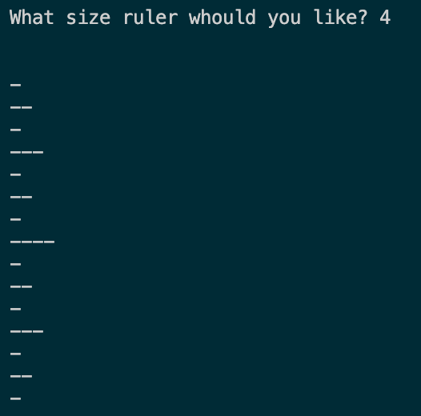

## Recursive Ruler

In this assignment, you will write a function that prints a digital ruler, recursively.

### Description

Write a recursive function that takes a positive integer _n_ and prints to console a vertical ruler, using the following specifications. The ruler will have 2n - 1 lines.

- Assume the whole ruler is '1'
- Use one hyphen for each 'mark'
- The line in the middle of the ruler, which corresponds to 1/2, contains _n_ marks
- The lines in the middle of each half, corresponding to 1/4 and 3/4, contain (_n_ - 1) marks
- The lines at 1/8, 3/8, 5/8, and 7/8 each contain (_n_ - 2) marks
- And so on, all the way until the end, where:
- The lines at the 1/2k, 3/2k, 5/2k, ..., (2_k_ - 1) / (2_k_) locations contain 1 mark.

**Example:**

A few tips:

- For a given _n_, think about what `recursiveRuler(n - 1)` does. How can you use `recursiveRuler(n - 1)` to help print the ruler of size _n_?
- You may want to have more than one recursive call

### Learning Targets

By the end of this assignment, you should be able to:

- Write a function with multiple recursion calls
- Handle base cases in recursive functions
- Identify recursion visually
- Decompose a recursive picture into its separate calls
