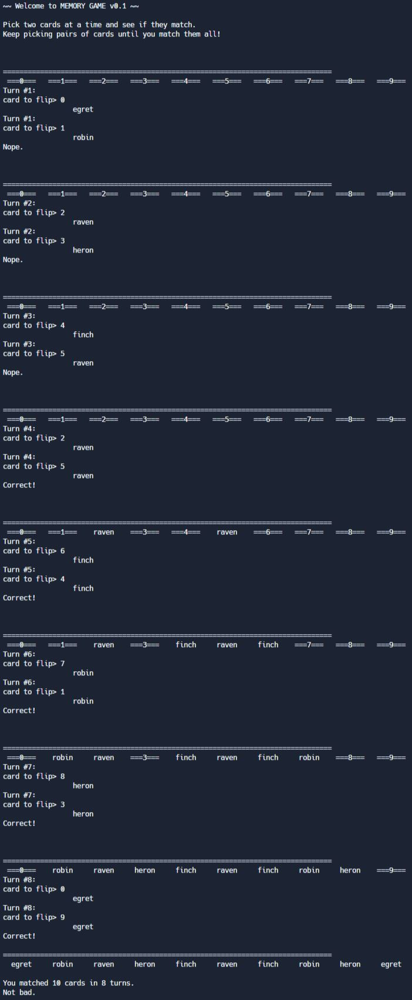
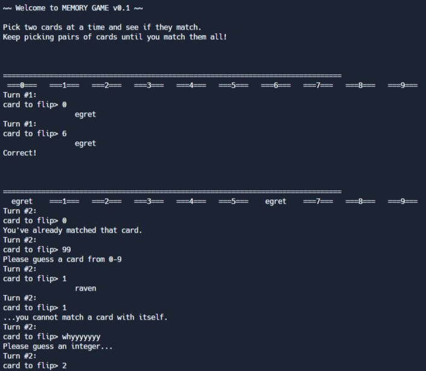
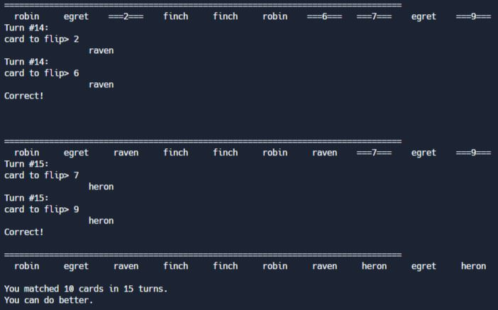

## Memory Game (final project)

In this assignment, you will write a complete memory game, to be played in the console.

### Description

Memory games are a group of classic card games. Usually, the player choose as many pairs of cards as they want, shuffles them, and places them face down on a table. Then they take turns turning over two cards at a time. If the two cards match (both red twos, or black fives, etc), the player gets to keep the pair. If they don’t match, they turn the cards back face down. In a one-player version of the game, the goal is to clear the board of all cards in as few flips as possible. In a game with two or more players, the goal is to have the most cards at the end of the game (when the board is cleared).

For the final project in this class, you’re going to write a console-based memory game, allowing a single user to select two cards at a time and see if they match. There are many important details you need to know about the game before you begin writing your code, so please read carefully.

### Project Requirements

You have some freedom in how you want your game to look. Here are the requirements for the full program:

- the program should print out adequate instructions throughout the game (see examples below)
- the program starts with 10 cards (5 pairs) face down
- the user selects a card and is shown what that card is
- the user selects a second card and is shown that card, as well as if it’s a match or not
- playing the game again should present the user with a different setup (i.e., the cards should be randomly shuffled each game)
- the program should handle invalid user input properly by re-asking for a value (see Example 2)
- the program should handle invalid selections (e.g., same card) by not doing them (and telling the user it was an invalid selection)
- the game should end once all cards have been matched
- when the game ends display a status message showing how many cards matched, how many turns it took, and a message based on those numbers (e.g., 10 cards in 5 turns: super!, 10 cards in 8 turns: not bad, 10 cards in 35 turns: better luck next time)
- all output should be clean and easy to read

### Functions and Top-Down Design

Your program must be broken down into functions. Each function should perform exactly one task and perform it well. Compose these functions together to make the game work properly. You must have a `main` function, but it should be very scant. The vast majority of the program should comprise functions other than `main`.

### Variable Naming

Your memory game code should follow standard variable naming conventions, using camelCase for all names composed of multiple words. All variables must be named accurately and should be succinct where possible. For instance, if defining two variables for the player’s choice of cards, use `playerChoice1` and `playerChoice2` instead of something like `c1` and `c2`. Any reader of your code should not have to work to understand the purpose of any of your variables.

### Data Structure for Cards

It is recommended that you store your cards as a list of strings, perhaps like this:
`birds = ["finch","robin","crane","macaw","stork","egret","raven"]`.

### `shuffle`

The `random` modle includes a `shuffle` function that, given a python list, will shuffle the items in the list (in place). You are welcome to use the `shuffle` function to randomize your cards at the beginning of the game. You're also welcome to write your own shuffle function if you feel up to the task.

### String Formatting

Though we have not used it in the past, Python includes a width specifier for strings. Using the width specifier will probably help you line up all of your cards. In the following example, using `%10s` means strings with fewer than 10 characters are padded on the left with spaces:

```
>>> names = ["grayson", "school", "aline", "0123456789"]
>>> for i in range(len(names)):
...    print("===%10s===" % (names[i]))
...
===   grayson===
===    school===
===     aline===
===0123456789===
```

Though not a requirement, your memory game might look better if you center the word inside the equals signs. You can write your own function for this action if you’d like. Or you can cleverly choose the content that goes inside the equal signs.

### Examples

**Example 1:** A regular game



**Example 2: ** The beginning of a game, demonstrating how your program should handle the following invalid inputs and selections:

- an already matched card (0 on the second turn, in this case)
- integer input outside the range (99)
- matching a card with itself (1)
- non-integer input ('whyyyyyyy')



**Example 3:** The end of a game with lots of turns



### Learning Targets

By the end of this assignment, you should be able to:

- Design a program using the top-down design framework
- Decompose a copmlex program into multiple functions, each of which accomplishes a single task
- Coordinate return values and arguments of functions
- Implement branching logic in the context of a larger program
- Implement for and while loops in the context of a larger program
- Manipulate strings and lists using their respective methods
- Write code that maintains a high level of readability
- Align code with industry-standard variable naming conventions
- Build engaging interactivity into a console-based game
-
